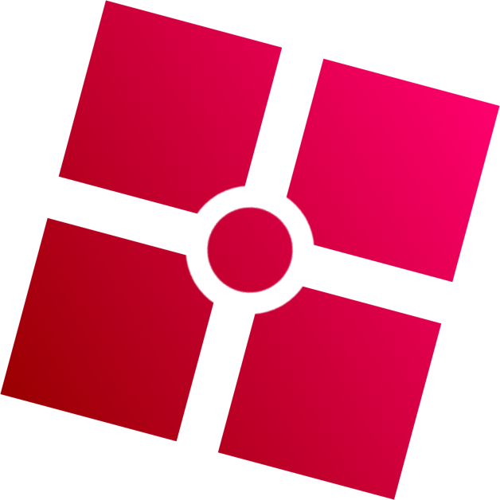

<h1>
    
    Kliko's modding tool
</h1>

I'm working on a personal project to enhance a modding tool I forked. I'm still in the development phase, but I'm excited to focus on adding original features and improvements to make the user experience even better.

## Goals

- **Enhancement:** My primary goal is to refine and build upon the existing features to create a better user experience.
- **Originality:** I am committed to ensuring that this project remains unique and distinct from other similar platforms.

- **Credit** credit for https://github.com/TheKliko this is hes website not mine im just trying to make something better since im bored.
